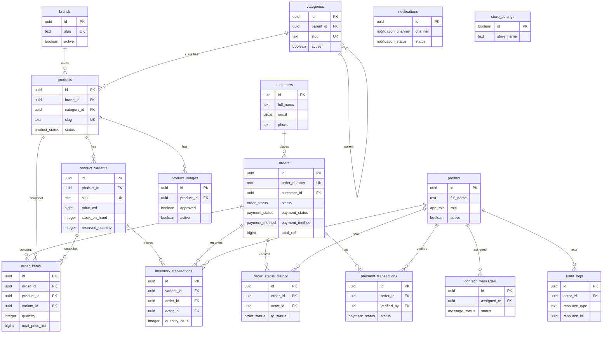

# Database Schema

Supabase PostgreSQL is the source of truth. All exposed tables use UUID primary keys, UTC timestamps, constraints, indexes, and RLS. Monetary amounts are stored as integer XOF values.

The first migration is `supabase/migrations/20260713000100_initial_schema.sql`.
Phase 3 adds `supabase/migrations/20260713000200_auth_profile_sync.sql` for Auth-user profile synchronization.

## ERD



## Enum Types

- `app_role`: `OWNER`, `ADMIN`, `INVENTORY_MANAGER`, `ORDER_MANAGER`, `CUSTOMER_SUPPORT`
- `product_status`: `DRAFT`, `ACTIVE`, `ARCHIVED`
- `inventory_transaction_type`: `RECEIVED`, `RESERVED`, `RELEASED`, `SOLD`, `RETURNED`, `DAMAGED`, `ADJUSTMENT`
- `order_status`: `PENDING_CONFIRMATION`, `CONFIRMED`, `PREPARING`, `READY_FOR_PICKUP`, `OUT_FOR_DELIVERY`, `DELIVERED`, `CANCELLED`, `RETURNED`
- `payment_status`: `UNPAID`, `PENDING`, `PAID`, `FAILED`, `REFUNDED`, `PARTIALLY_REFUNDED`
- `payment_method`: `CASH_ON_DELIVERY`, `ORANGE_MONEY`, `MTN_MOMO`, `WAVE`, `MOOV_MONEY`, `BANK_TRANSFER`, `PAY_IN_STORE`
- `order_source`: `WEBSITE`, `INSTAGRAM`, `FACEBOOK`, `TIKTOK`, `WHATSAPP`, `PHONE`, `PHYSICAL_STORE`, `OTHER`
- `message_status`: `NEW`, `OPEN`, `RESOLVED`, `SPAM`
- `message_source`: `WEBSITE`, `INSTAGRAM`, `FACEBOOK`, `TIKTOK`, `WHATSAPP`, `PHONE`, `EMAIL`, `OTHER`
- `notification_channel`: `EMAIL`, `IN_APP`
- `notification_status`: `PENDING`, `PROCESSING`, `SENT`, `FAILED`, `CANCELLED`

## Business Invariants

- Every exposed table has RLS enabled.
- Admin/staff users live in `profiles`, keyed to `auth.users(id)` with `on delete cascade`.
- New `auth.users` rows are synchronized into `public.profiles` by `app_private.handle_new_auth_user()`.
- Synchronized profiles use the Auth user UUID, are inserted only when missing, and are inactive by default.
- The sync trigger may copy harmless display-name text from Auth metadata, but it never copies roles, active status, email domains, provider metadata, or authorization claims.
- Existing profiles are never overwritten by the backfill; existing roles, inactive users, and owners are preserved.
- Active staff reads use `app_private.has_staff_role(...)`; the helper is `SECURITY DEFINER`, outside exposed schemas, uses an empty `search_path`, fully qualifies relations, and is not executable by `PUBLIC`.
- Anonymous users can read only active brands/categories, `ACTIVE` products, active variants for active products, approved active images for active products, and public store settings.
- Public users cannot directly insert orders, inventory transactions, notifications, audit logs, or payment records.
- Sensitive writes must happen through server-side routes/actions using the privileged server client or through controlled database functions.
- Product and category slugs are unique and lowercase URL slugs.
- Product variants require a unique SKU, positive `size_ml`, non-negative prices, non-negative stock counts, and `reserved_quantity <= stock_on_hand`.
- Order currency is fixed to `XOF`.
- Order delivery country is fixed to `CI`.
- Order totals must satisfy `total_xof = subtotal_xof + delivery_fee_xof - discount_xof`.
- Order item totals must satisfy `total_price_xof = unit_price_xof * quantity`.
- Inventory transactions require a non-zero signed `quantity_delta`, stock/reserved snapshots, reason, and optional order/actor references.
- Contact messages require a customer name, body, and at least one contact method.
- `store_settings` is a singleton table with `id = true`.
- `updated_at` is maintained by `public.set_updated_at()` on mutable tables.
- `audit_logs.metadata` must be redacted; never store full addresses, secrets, payment credentials, OTPs, PINs, or CVVs.

## Indexes

The first migration adds indexes for:

- Product status, slug, and featured products.
- Variant SKU and product ID.
- Order number, status, payment status, created timestamp, and customer phone.
- Inventory variant and created timestamp.
- Message status and created timestamp.
- Notification status and scheduled timestamp.
- Audit resource and created timestamp.

## Local Reset, Seed, and Verification

For local development only, run:

```bash
pnpm exec supabase start
pnpm exec supabase db reset
psql "$DATABASE_URL" -f supabase/tests/schema_smoke.sql
```

`supabase db reset` is destructive to the local Supabase database only. Do not run it against the linked remote project. The seed creates placeholder store settings plus a few brands and categories. It intentionally does not create a fake owner UUID.

For the linked existing Supabase project, review migrations first, then apply forward-only changes with:

```bash
pnpm exec supabase migration list
pnpm exec supabase db push
```

## Type Generation

`src/types/database.types.ts` is generated from the linked Supabase project and currently includes the Phase 2 public tables and enums. Regenerate it after every schema change:

```bash
pnpm exec supabase gen types typescript --linked > src/types/database.types.ts
```
