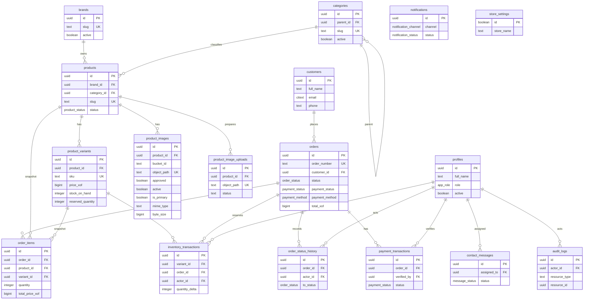

# Database Schema

Supabase PostgreSQL is the source of truth. All exposed tables use UUID primary keys, UTC timestamps, constraints, indexes, and RLS. Monetary amounts are stored as integer XOF values.

The first migration is `supabase/migrations/20260713000100_initial_schema.sql`.
Phase 3 adds `supabase/migrations/20260713000200_auth_profile_sync.sql` for Auth-user profile synchronization.
Phase 4 adds `supabase/migrations/20260714000100_catalogue_storage_domain.sql` for product image Storage, public catalogue views, activation invariants, and cost-price protection.

## ERD


```mermaid
erDiagram
  profiles {
    uuid id PK
    text full_name
    app_role role
    boolean active
  }
  brands {
    uuid id PK
    text slug UK
    boolean active
  }
  categories {
    uuid id PK
    uuid parent_id FK
    text slug UK
    boolean active
  }
  products {
    uuid id PK
    uuid brand_id FK
    uuid category_id FK
    text slug UK
    product_status status
  }
  product_variants {
    uuid id PK
    uuid product_id FK
    text sku UK
    bigint price_xof
    integer stock_on_hand
    integer reserved_quantity
  }
  product_images {
    uuid id PK
    uuid product_id FK
    text bucket_id
    text object_path UK
    boolean approved
    boolean active
    boolean is_primary
    text mime_type
    bigint byte_size
  }
  product_image_uploads {
    uuid id PK
    uuid product_id FK
    text object_path UK
    text status
  }
  customers {
    uuid id PK
    text full_name
    citext email
    text phone
  }
  orders {
    uuid id PK
    text order_number UK
    uuid customer_id FK
    order_status status
    payment_status payment_status
    payment_method payment_method
    bigint total_xof
  }
  order_items {
    uuid id PK
    uuid order_id FK
    uuid product_id FK
    uuid variant_id FK
    integer quantity
    bigint total_price_xof
  }
  order_status_history {
    uuid id PK
    uuid order_id FK
    uuid actor_id FK
    order_status to_status
  }
  payment_transactions {
    uuid id PK
    uuid order_id FK
    uuid verified_by FK
    payment_status status
  }
  inventory_transactions {
    uuid id PK
    uuid variant_id FK
    uuid order_id FK
    uuid actor_id FK
    integer quantity_delta
  }
  contact_messages {
    uuid id PK
    uuid assigned_to FK
    message_status status
  }
  notifications {
    uuid id PK
    notification_channel channel
    notification_status status
  }
  store_settings {
    boolean id PK
    text store_name
  }
  audit_logs {
    uuid id PK
    uuid actor_id FK
    text resource_type
    uuid resource_id
  }

  brands ||--o{ products : owns
  categories ||--o{ categories : parent
  categories ||--o{ products : classifies
  products ||--o{ product_variants : has
  products ||--o{ product_images : has
  products ||--o{ product_image_uploads : prepares
  customers ||--o{ orders : places
  orders ||--o{ order_items : contains
  products ||--o{ order_items : snapshot
  product_variants ||--o{ order_items : snapshot
  orders ||--o{ order_status_history : records
  profiles ||--o{ order_status_history : acts
  orders ||--o{ payment_transactions : has
  profiles ||--o{ payment_transactions : verifies
  product_variants ||--o{ inventory_transactions : moves
  orders ||--o{ inventory_transactions : reserves
  profiles ||--o{ inventory_transactions : acts
  profiles ||--o{ contact_messages : assigned
  profiles ||--o{ audit_logs : acts
```

## Enum Types

- `app_role`: `OWNER`, `ADMIN`, `INVENTORY_MANAGER`, `ORDER_MANAGER`, `CUSTOMER_SUPPORT`
- `product_status`: `DRAFT`, `ACTIVE`, `ARCHIVED`
- `inventory_transaction_type`: `RECEIVED`, `RESERVED`, `RELEASED`, `SOLD`, `RETURNED`, `DAMAGED`, `ADJUSTMENT`
- `order_status`: `PENDING_CONFIRMATION`, `CONFIRMED`, `PREPARING`, `READY_FOR_PICKUP`, `OUT_FOR_DELIVERY`, `DELIVERED`, `CANCELLED`, `RETURNED`
- `payment_status`: `UNPAID`, `PENDING`, `PAID`, `FAILED`, `REFUNDED`, `PARTIALLY_REFUNDED`
- `payment_method`: `CASH_ON_DELIVERY`, `ORANGE_MONEY`, `MTN_MOMO`, `WAVE`, `MOOV_MONEY`, `BANK_TRANSFER`, `PAY_IN_STORE`
- `order_source`: `WEBSITE`, `INSTAGRAM`, `FACEBOOK`, `TIKTOK`, `WHATSAPP`, `PHONE`, `PHYSICAL_STORE`, `OTHER`
- `message_status`: `NEW`, `OPEN`, `RESOLVED`, `SPAM`
- `message_source`: `WEBSITE`, `INSTAGRAM`, `FACEBOOK`, `TIKTOK`, `WHATSAPP`, `PHONE`, `EMAIL`, `OTHER`
- `notification_channel`: `EMAIL`, `IN_APP`
- `notification_status`: `PENDING`, `PROCESSING`, `SENT`, `FAILED`, `CANCELLED`

## Business Invariants

- Every exposed table has RLS enabled.
- Admin/staff users live in `profiles`, keyed to `auth.users(id)` with `on delete cascade`.
- New `auth.users` rows are synchronized into `public.profiles` by `app_private.handle_new_auth_user()`.
- Synchronized profiles use the Auth user UUID, are inserted only when missing, and are inactive by default.
- The sync trigger may copy harmless display-name text from Auth metadata, but it never copies roles, active status, email domains, provider metadata, or authorization claims.
- Existing profiles are never overwritten by the backfill; existing roles, inactive users, and owners are preserved.
- Active staff reads use `app_private.has_staff_role(...)`; the helper is `SECURITY DEFINER`, outside exposed schemas, uses an empty `search_path`, fully qualifies relations, and is not executable by `PUBLIC`.
- Anonymous users can read only active brands/categories, `ACTIVE` products, active variants for active products, approved active images for active products, and public store settings.
- Phase 4 narrows catalogue grants so anonymous clients cannot select `product_variants.cost_price_xof`. Public catalogue access should use the safe `public_catalogue_products`, `public_catalogue_variants`, and `public_catalogue_images` views or application DTOs.
- Product image objects live in the public `product-images` Supabase Storage bucket. Public bucket objects are not confidential; a draft image can be retrieved by anyone who knows its exact public URL.
- Product image object paths are generated server-side as `products/<product-uuid>/<random-uuid>.<jpg|png|webp>` and stored as the canonical reference.
- `ACTIVE` products are rejected unless they have a non-empty name, non-empty description, at least one active variant with a positive price, and at least one approved active validated image.
- Mutations that would remove the last valid active variant or image from an `ACTIVE` product are rejected by database triggers.
- Public users cannot directly insert orders, inventory transactions, notifications, audit logs, or payment records.
- Sensitive writes must happen through server-side routes/actions using the privileged server client or through controlled database functions.
- Product and category slugs are unique and lowercase URL slugs.
- Product variants require a unique SKU, positive `size_ml`, non-negative prices, non-negative stock counts, and `reserved_quantity <= stock_on_hand`.
- Available stock is calculated as `stock_on_hand - reserved_quantity`; it is not stored as a separate editable field.
- Order currency is fixed to `XOF`.
- Order delivery country is fixed to `CI`.
- Order totals must satisfy `total_xof = subtotal_xof + delivery_fee_xof - discount_xof`.
- Order item totals must satisfy `total_price_xof = unit_price_xof * quantity`.
- Inventory transactions require a non-zero signed `quantity_delta`, stock/reserved snapshots, reason, and optional order/actor references. Phase 6.5 permits a zero-delta transaction only for the explicit initial-stock operation when metadata marks `operation = INITIAL_STOCK`.
- Contact messages require a customer name, body, and at least one contact method.
- `store_settings` is a singleton table with `id = true`.
- `updated_at` is maintained by `public.set_updated_at()` on mutable tables.
- `audit_logs.metadata` must be redacted; never store full addresses, secrets, payment credentials, OTPs, PINs, or CVVs.

## Indexes

The first migration adds indexes for:

- Product status, slug, and featured products.
- Variant SKU and product ID.
- Order number, status, payment status, created timestamp, and customer phone.
- Inventory variant and created timestamp.
- Message status and created timestamp.
- Notification status and scheduled timestamp.
- Audit resource and created timestamp.

Phase 4 adds indexes for case-insensitive product slugs, active/featured product listing, product brand/category filters, variant active/price filters, product image sort order, primary image uniqueness, and pending image upload expiry.

## Supabase Storage

The `product-images` bucket is configured by migration:

- `id`: `product-images`
- `name`: `product-images`
- `public`: `true`
- file size limit: `5242880` bytes
- MIME types: `image/jpeg`, `image/png`, `image/webp`

Storage writes on `storage.objects` are restricted to authenticated active `OWNER` and `ADMIN` profiles for `bucket_id = 'product-images'`. Public downloads rely on the public bucket model.

The Phase 5 admin UI reads staff catalogue data through server-only authorized repositories. Public catalogue queries must continue to use the safe public boundary and must not expose `cost_price_xof`.

## Storefront Content

Phase 6.5 adds `public.store_content` as a forward-only content-management table.

- `page_key` is the primary key and is constrained to `home`, `about`, `contact`, `delivery`, or `social`.
- `content` is JSONB constrained to an object. Application Zod schemas strictly validate the object shape for each page key.
- `public_readable` controls public read exposure.
- `updated_by` references `public.profiles(id)` for staff attribution.
- `created_at` and `updated_at` use UTC timestamps; `updated_at` is maintained by `public.set_updated_at()`.
- RLS is enabled. Anonymous and authenticated visitors may read rows where `public_readable is true`; authenticated active OWNER and ADMIN staff may insert/update content.

This table stores public copy and social/contact values only. It must not store secrets, arbitrary HTML, customer data, tokens, signed URLs, or private settings.

## Inventory Initialization

Phase 6.5 adds `product_variants.inventory_initialized_at` in migration `20260718141514_variant_inventory_initialization.sql`.

- `null` means stock has never been initialized for the variant.
- A non-null timestamp means `stock_on_hand` and `reserved_quantity` represent configured inventory.
- Availability remains derived from `stock_on_hand - reserved_quantity`; no editable availability column or status is stored.
- The public catalogue variant view exposes `UNCONFIGURED` when inventory is not initialized and otherwise derives `IN_STOCK`, `LOW_STOCK`, or `OUT_OF_STOCK`.
- `public.initialize_variant_inventory(target_variant_id, initial_stock, movement_reason)` is a `SECURITY DEFINER` RPC. It locks the variant row, rejects negative stock, rejects already-initialized variants, updates inventory fields, stamps `inventory_initialized_at`, and inserts an `inventory_transactions` row with actor and reason.
- Execute permission is granted only to authenticated users; the function itself restricts execution to active `OWNER`, `ADMIN`, and `INVENTORY_MANAGER` staff.

After applying this migration to a linked Supabase project, regenerate generated types with:

```bash
pnpm exec supabase gen types typescript --linked > src/types/database.types.ts
```

## Phase 8 Guest Orders

Phase 8 adds `supabase/migrations/20260723080100_phase8_guest_order_transaction.sql`.

- `customers.normalized_phone` stores canonical Côte d'Ivoire phone numbers as `+225XXXXXXXXXX` and is unique when present.
- `order_items` gains protected historical snapshot columns: `brand_name`, `product_slug`, `size_ml`, `concentration`, and fixed `currency = XOF`.
- `notifications.idempotency_key` prevents duplicated outbox intents for idempotent order retries.
- `store_settings.enabled_payment_methods` and `store_settings.enabled_delivery_methods` are the transaction-time enabled-method source.
- `app_private.guest_order_idempotency` stores operation/key/fingerprint/order result state outside the exposed API.
- `app_private.create_guest_order(request jsonb)` is the private transactional order engine.
- `public.create_guest_order_server(request jsonb)` is a service-role-only wrapper because `app_private` is not exposed through Supabase REST.

The transaction locks affected variants/products in deterministic variant-ID order, validates ACTIVE publication requirements, active variants, positive prices, initialized inventory and available quantity, creates the customer/order/items/history/audit/notification rows, increments `reserved_quantity`, and inserts `RESERVED` inventory ledger rows. `stock_on_hand` is not decremented.

## Phase 9 Checkout And Tracking

Initial Phase 9 checkout and tracking did not add a database migration. Checkout submits to the existing Phase 8 `/api/orders` contract and order transaction.

Confirmation detail recovery is intentionally client-session scoped and does not add a broadly readable order lookup table or view. Public order tracking is a server-only lookup requiring both `orders.order_number` and the submitted `orders.customer_phone`; it returns a limited customer-facing projection and never exposes internal order IDs, customer IDs, inventory reservations, audit rows, notification rows, or staff notes.

Terms acceptance is currently enforced by the checkout UI only. The schema has no terms-version/timestamp snapshot column; add a forward-only migration before relying on terms acceptance for audit or legal proof.

## Phase 9 Payment Settings And WhatsApp Intents

Migration `20260727090100_phase9_payment_settings_whatsapp_intents.sql` adds:

- `store_settings.payment_method_configs jsonb`, a structured public payment-method configuration object. OWNER and ADMIN manage enabled methods, customer labels, merchant numbers, beneficiaries, instructions, and display order from `/admin/contenu`.
- `public.storefront_order_intents`, a lightweight analytics record for intentional WhatsApp ordering clicks after authoritative cart validation.
- `public.storefront_order_intent_items`, safe authoritative item snapshots for the intent event.

The intent tables are RLS-enabled. Anonymous users do not insert directly; `/api/storefront/order-intents/whatsapp` writes through the server-controlled boundary. Staff read policies are limited to OWNER, ADMIN, and ORDER_MANAGER.

A WhatsApp intent means only: the customer clicked the WhatsApp ordering action after cart validation. It does not mean WhatsApp opened, the message was sent, an order was created, payment occurred, or stock was reserved. Intent retention defaults to 30 days through `expires_at`; operational cleanup should remove expired rows.

## Phase 10 Inventory Adjustments

Migration `20260803143000_phase10_inventory_adjustments.sql` adds:

- `app_private.inventory_adjustment_idempotency`, a private idempotency table for manual inventory operations.
- `public.admin_inventory_variants`, a staff/admin inventory view that derives available quantity and inventory status from `product_variants`; it does not store availability.
- `app_private.adjust_inventory(request jsonb)`, the private transactional manual inventory engine.
- `public.adjust_inventory_server(request jsonb)`, a service-role-only wrapper for server application code.

Manual operations are `INITIALIZE`, `RECEIVED`, `DAMAGED`, `ADJUSTMENT`, and `RETURNED`. `RESERVED`, `RELEASED`, and `SOLD` remain system-controlled order/fulfilment operations. The function locks the target variant row with `FOR UPDATE`, enforces `stock_on_hand >= 0`, `reserved_quantity >= 0`, and `reserved_quantity <= stock_on_hand`, updates only `stock_on_hand` and initialization state, inserts one immutable `inventory_transactions` row, and writes a bounded `INVENTORY_ADJUSTED` audit event.

Ledger rows remain immutable through the application. Corrections must be compensating `ADJUSTMENT` rows, not edits or deletes to historical transactions.

## Local Reset, Seed, and Verification

For local development only, run:

```bash
pnpm exec supabase start
pnpm exec supabase db reset
psql "$DATABASE_URL" -f supabase/tests/schema_smoke.sql
psql "$DATABASE_URL" -f supabase/tests/phase4_catalogue_storage.sql
```

`supabase db reset` is destructive to the local Supabase database only. Do not run it against the linked remote project. The seed creates placeholder store settings plus a few brands and categories. It intentionally does not create a fake owner UUID.

For the linked existing Supabase project, review migrations first, then apply forward-only changes with:

```bash
pnpm exec supabase migration list
pnpm exec supabase db push
pnpm exec supabase gen types typescript --linked > src/types/database.types.ts
```

## Type Generation

`src/types/database.types.ts` is generated from the linked Supabase project and currently includes the Phase 2 public tables and enums. Regenerate it after every schema change:

```bash
pnpm exec supabase gen types typescript --linked > src/types/database.types.ts
```
